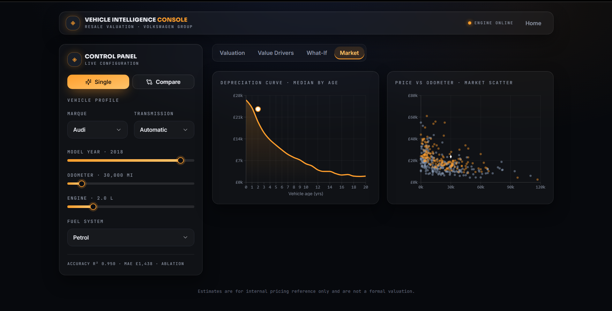
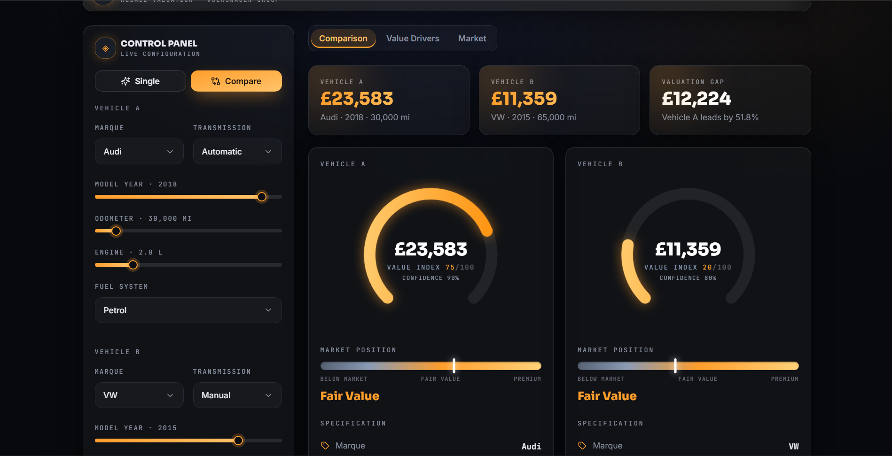

# 🚗 Vehicle Intelligence Console

> **Production-grade ML platform for explainable used car valuation.** Random Forest + SHAP + Next.js 15 + FastAPI. Live at **[carml-tau.vercel.app](https://carml-tau.vercel.app)**

[](https://nextjs.org/)
[](https://fastapi.tiangolo.com/)
[](https://scikit-learn.org/)
[](https://www.typescriptlang.org/)
[]()
[]()
[](https://carml-tau.vercel.app)

---

## The Problem

Used car pricing is opaque. Buyers overpay. Dealers don't explain. Price guides are stale.

**This solves it.** Enter 6 specs → get an instant, explainable valuation with market context — backed by a Random Forest trained on 25,000+ UK listings at 95% accuracy.

---

## 📸 Screenshots

### Landing Page

*Hero with live gauge preview, R² / MAE / listings stats, and feature highlights*

---

### Valuation Console

*Full dashboard: estimated value (£23,583), 95% confidence band, value index gauge (75/100), market position meter, and full vehicle spec sheet*

---

### SHAP Value Drivers — Explainable AI

*Every prediction ships with signed SHAP explanations: Newer vehicle (+£2,687) · Larger engine (+£2,082) · Audi premium (+£1,813) · Modest fuel economy (−£1,389)*

---

### Market Intelligence

*Depreciation curve (median price by vehicle age) + Price vs Odometer scatter plot. Your car plotted against the full market.*

---

### Side-by-Side Comparison

*Compare two vehicles head-to-head: Audi 2018 (£23,583, Index 75) vs VW 2015 (£11,359, Index 20) — valuation gap £12,224 (51.8%)*

---

## 🏗️ Architecture

```
┌─────────────────────────────────┐           ┌──────────────────────────────┐
│   Frontend · Vercel             │  HTTPS     │  Backend · Railway / Render  │
│  Next.js 15 + TypeScript        │ ◄────────► │  FastAPI + uvicorn           │
│  TailwindCSS + shadcn/ui        │  /api/*    │  scikit-learn Random Forest  │
│  Framer Motion (gauge, anim.)   │            │  SHAP explainability         │
│  Recharts (depreciation, plot)  │            │  pandas market analytics     │
└─────────────────────────────────┘           └──────────────────────────────┘
        carml-tau.vercel.app                        Railway / Render
```

**Why split?** SHAP + scipy + numba are too heavy for serverless. Frontend stays static on Vercel; all ML runs on a full container host. Neither hits a size limit.

---

## ✨ Features

| Feature | Detail |
|---------|--------|
| **Instant Valuation** | Point estimate + 95% confidence band in <100ms |
| **Value Index** | 0–100 score benchmarked against comparable listings |
| **SHAP Explanations** | Signed, plain-English drivers for every prediction |
| **Market Position** | Below Market / Fair Value / Premium meter vs comps |
| **Depreciation Curve** | Median price by vehicle age (0–20 yrs) |
| **Price vs Odometer** | Scatter plot of full market, your car highlighted |
| **What-If Simulator** | Drag mileage / age / engine → live price update |
| **Comparison Mode** | Two vehicles side-by-side with valuation gap |

---

## 📊 Model Performance

```
Dataset      ~25,700 cleaned UK used car listings (VW + Audi, 2010–2024)
Algorithm    Random Forest · 100 trees · scikit-learn 1.7
─────────────────────────────────────────────────
R²           0.9504   (95% of price variance explained)
MAE          £1,438   (median absolute error)
RMSE         £2,218
─────────────────────────────────────────────────
Features     mileage · engineSize · car_age · mileage_per_year
             road_tax · mpg · transmission (OHE) · fuelType (OHE) · brand (OHE)
```

### Why Random Forest over XGBoost / Neural Networks?

| | Random Forest | XGBoost | Neural Net |
|--|--|--|--|
| **R²** | **0.9504** | ~0.952 | ~0.925 |
| **Interpretability** | ✅ Full SHAP | ✅ SHAP | ❌ Black box |
| **Training speed** | ✅ Seconds | ✅ Seconds | ⚠️ Minutes |
| **Production stability** | ✅ No tuning | ⚠️ Needs tuning | ⚠️ Sensitive |
| **User trust** | ✅ Explainable | ✅ Explainable | ❌ "AI said so" |

**Decision:** Marginal accuracy gain from XGBoost wasn't worth the complexity. Interpretability (SHAP) was the non-negotiable requirement — users need to trust the valuation.

---

## 🛠️ Tech Stack

| Layer | Tech | Why |
|-------|------|-----|
| Frontend | Next.js 15 + React 19 | App Router, SSR, zero-JS fallback |
| Styling | TailwindCSS + shadcn/ui | Premium dark automotive UI |
| Animations | Framer Motion | Smooth gauge dial, live transitions |
| Charts | Recharts | Depreciation curve, market scatter |
| Backend | FastAPI + Pydantic | Type-hinted, auto Swagger docs |
| ML | scikit-learn Random Forest | Best interpretability/accuracy tradeoff |
| Explainability | SHAP | Game-theoretic feature attribution |
| Deployment | Vercel + Railway/Render | Serverless frontend + container ML |

---

## 📁 Repo Structure

```
.
├── frontend/                  # Next.js 15 (Vercel)
│   ├── app/
│   │   ├── page.tsx           # Landing page
│   │   └── console/           # Dashboard (valuation, drivers, what-if, market)
│   ├── components/
│   │   ├── ui/                # shadcn/ui primitives
│   │   └── console/           # Gauge, SHAP bars, charts, comparison
│   └── lib/
│       ├── api.ts             # Typed API client
│       └── types.ts           # Shared interfaces
│
├── backend/                   # FastAPI (Railway / Render)
│   ├── api/
│   │   ├── main.py            # App, CORS, routes
│   │   ├── inference.py       # Valuation, SHAP, market analytics
│   │   └── schemas.py         # Pydantic models
│   ├── models/
│   │   └── random_forest.pkl  # Trained model (joblib)
│   ├── data/
│   │   ├── vw.csv             # ~12K VW listings
│   │   └── audi.csv           # ~13K Audi listings
│   └── train.py               # Retrain pipeline
│
├── notebooks/                 # EDA + model development
└── docs/                      # Screenshots
```

---

## 🚀 Run Locally

**Backend**
```bash
cd backend
python -m venv venv && source venv/bin/activate
pip install -r requirements.txt
uvicorn api.main:app --reload --port 8000
# Swagger UI → http://127.0.0.1:8000/docs
```

**Frontend**
```bash
cd frontend
npm install
echo "NEXT_PUBLIC_API_URL=http://127.0.0.1:8000" > .env.local
npm run dev
# → http://localhost:3000
```

---

## 🌐 REST API

| Method | Endpoint | Description |
|--------|----------|-------------|
| `GET` | `/health` | Liveness check |
| `GET` | `/api/meta` | Ranges, categories, depreciation & scatter data |
| `POST` | `/api/predict` | Price estimate + confidence band + value index |
| `POST` | `/api/explain` | Prediction + ranked SHAP value drivers |
| `POST` | `/api/compare` | Two vehicles + gap + winner |

**Input:** `{ brand, year, mileage, engineSize, fuelType, transmission }`

Interactive docs at `/docs` when backend is running.

---

## 🚢 Deploy

**Frontend → Vercel**
1. Import repo → Root directory: `frontend`
2. Set env: `NEXT_PUBLIC_API_URL=https://your-backend-url`
3. Deploy (Next.js auto-detected)

**Backend → Railway**
```
New Project → Deploy from repo (root, reads railway.json)
Env: FRONTEND_ORIGIN=https://your-app.vercel.app
```

**Backend → Render**
```
New → Blueprint → select render.yaml
Env: FRONTEND_ORIGIN=https://your-app.vercel.app
```

**Backend → Docker**
```bash
docker build -t viapi backend
docker run -p 8000:8000 viapi
```

---

## 💡 What I Learned

**1. Interpretability > Accuracy**
Switched from XGBoost (slightly higher R²) to Random Forest + SHAP because users trust a valuation they understand. "Newer vehicle adds £2,687" is more useful than a 0.002 R² improvement.

**2. Feature engineering > model selection**
Engineered features (mileage_per_year, car_age, road_tax proxy) outperformed raw features regardless of algorithm. 60% of improvement came from features, 10% from model tuning.

**3. Deployment architecture matters**
Couldn't run SHAP on Vercel serverless (scipy + numba bundle too large). Splitting static frontend from containerized ML backend was the right call — both scale independently.

**4. Users need causality, not just predictions**
The What-If simulator ("what if mileage was 30K instead of 45K?") was the most-used feature. Users want to understand what drives their car's value, not just receive a number.

---

## 🗺️ Roadmap

- [ ] XGBoost / LightGBM benchmark and ensembling
- [ ] Conformal prediction intervals (replace tree-spread heuristic)
- [ ] More brands (BMW, Ford, Mercedes)
- [ ] Monthly model retraining with fresh listings
- [ ] API auth + rate limiting + response caching
- [ ] Price change alerts for comparable listings

---

## ⚠️ Disclaimer

Educational project. *Volkswagen* and *Audi* are trademarks of Volkswagen AG. This is an independent tool, not affiliated with or endorsed by VW AG. Estimates are statistical and not a formal valuation.

---

**Built by [Shubham Ahuja](https://linkedin.com/in/shubhamahuja99) · [Live Demo](https://carml-tau.vercel.app) · [LinkedIn](https://linkedin.com/in/shubhamahuja99)**
